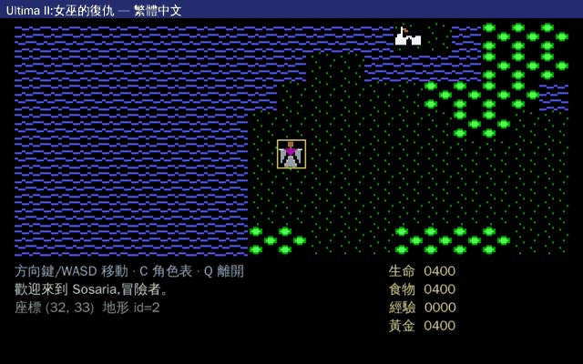
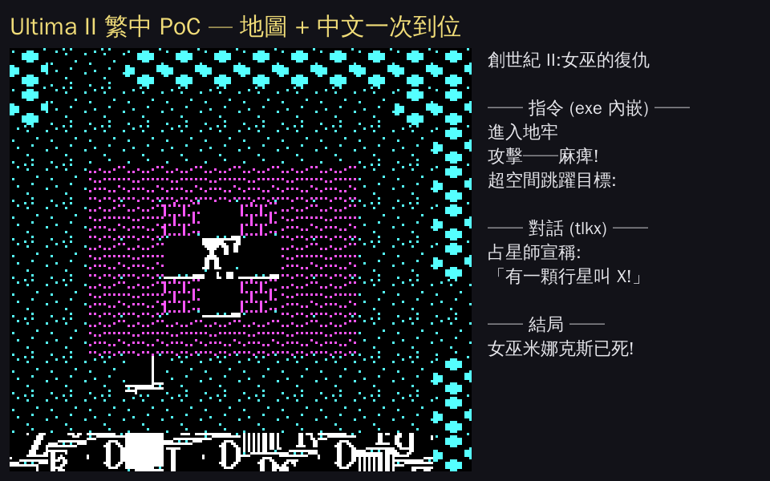
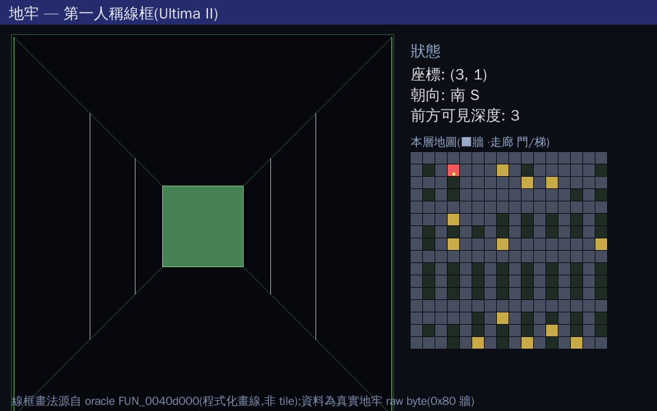
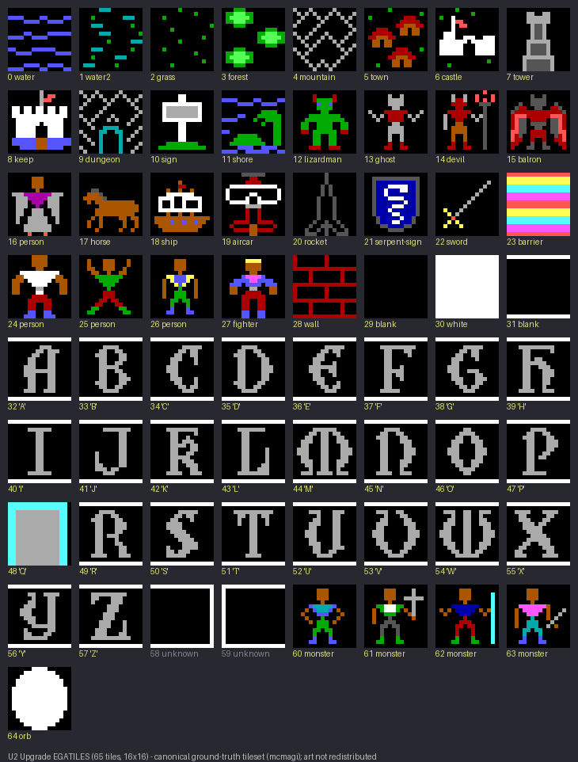
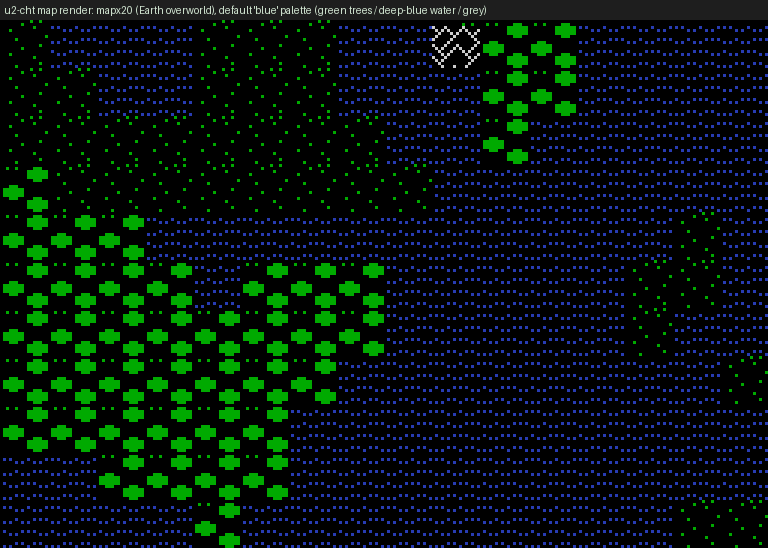
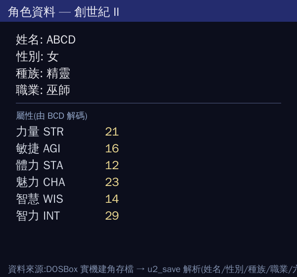

# Ultima II: Revenge of the Enchantress — 繁體中文化專案 (u2-cht)
### 創世紀 II:女巫的復仇 — 繁體中文化 + SDL2 引擎重建

> 把 1982 年的《創世紀 II:女巫的復仇》以**乾淨重寫的跨平台 C / SDL2 引擎**重建,並完整繁體中文化。
> 方法:反編原版當行為 oracle、破解原版資料格式、手寫可公開維護的引擎。
> 系列姊妹作:[u3-cht](https://github.com/wicanr2/u3-cht)(Ultima III)、[u6-cht](https://github.com/wicanr2/u6-cht)(Ultima VI)。


---

## 目錄

- [截圖](#截圖--screenshots)
- [關於 Ultima II](#關於-ultima-ii--about-ultima-ii)
- [為什麼做這個](#為什麼做這個--why)
- [技術架構](#技術架構--architecture)
- [進度](#進度--status)
- [資料格式破解亮點](#資料格式破解亮點--reverse-engineered-formats)
- [中文化管線](#中文化管線--localization)
- [建置與執行](#建置與執行--build--run)
- [專案結構](#專案結構--layout)
- [授權與免責](#授權與免責--license)
- [致謝與參考](#致謝與參考--credits--references)

---

## 截圖 / Screenshots

### 整合主迴圈(地面 ↔ 地牢 ↔ 角色表)

> 單一 `u2_game` 狀態機:地面行走 → 進地牢切第一人稱線框 → 任意模式按 `C` 疊加繁中角色資料表。
> 同一份引擎、同一套 CJK 文字層;此 GIF 由 headless `--script` 逐幀渲染組成。

### 城鎮 NPC 對話(端到端在地化)

> 踩到城鎮 tile 進城 → 走到 NPC 旁按 `T` 交談:引擎讀 `tlkx` 對話 → 翻譯覆蓋層 → CJK 顯示。
> 例:「流浪漢格倫德說:精通謎題者 方為真正的高手!」(tlkx21,原文 GRENDEL)。
> **NPC→對話行對應已破解**:monxNN 第 6 陣列 `0xA0+i`(`&0x80`=可交談,行索引 `(dlg&0x7f)-1`);
> monx21 的 4 個交談 NPC 正好對上 tlkx21 的 4 行對話。

### 地面走路特寫

> `u2_game`:玩家恆置中(黃框)、相機跟隨、方向鍵 / WASD 移動、`u2_passable` 擋海洋;
> 右側中文狀態欄(生命 / 食物 / 經驗 / 黃金,標籤查 exe 翻譯表)、底部即時座標與訊息列。
> 走到海邊時顯示「W 方向被擋住。」(碰撞)。此 GIF 由 headless `--script` 模式逐幀渲染組成,非錄螢幕。

### 中文化垂直切片 PoC(城鎮)

> 上方地圖 viewport(真實 tile + monxNN 實體層,空城 → 活城)、底部中文 NPC 對話、右側中文狀態欄。
> 對話與狀態標籤皆**非硬編**:引擎讀原始資料 → 翻譯覆蓋層 → CJK 原生繪製。

### 第一人稱線框地牢 + 多層換層

> 真實地牢檔(16 層,`level*256+Y*16+X`)以 oracle `FUN_0040d000` 程式化畫線渲染第一人稱走廊;
> 走到下梯(`&0x20`)按 `J` 下樓(HUD「樓層 1 → 2」),上梯(`&0x10`)按 `K`。右側繁中 HUD + 16×16 小地圖。


> 單張線框特寫:透視走廊 + 背牆 + 樓層/深度 HUD;小地圖黃色為門/梯,紅色為玩家。

### Ground-truth tileset(U2 Upgrade EGATILES)

> 65 個 16×16 tile:水 / 森林 / 山 / 城堡 / 船 / 馬 / 招牌 A–Z…(art 由玩家自備,本 repo 僅供研究對照)。

---

## 關於 Ultima II / About Ultima II

> 以下標 **[史實]** 為公開可考的常識性史實;標 **[本專案]** 為本 repo 的逆向發現或推測。

**《Ultima II: The Revenge of the Enchantress》(創世紀 II:女巫的復仇)** 是 Richard Garriott
(遊戲中化身 **Lord British / 不列顛王**)設計的角色扮演遊戲,**1982 年由 Sierra On-Line 發行**,
是 Ultima(創世紀)系列的第二作。 **[史實]**(Ultima II 是系列中唯一由 Sierra 發行者;
Garriott 隨後於 1983 年成立 Origin Systems 自行發行 Ultima III 起的後續作品。)

- **劇情設定 [史實]**:反派是女巫 **Minax(米娜克斯)**——前作 Ultima I 大魔王 **Mondain(蒙丹)**
  的徒弟。Minax 操弄時間復仇,玩家(**The Stranger / 異鄉人**)必須穿越
  **Time Doors(時光之門)** 在不同時代與星球間旅行,最終於傳說時代的城堡
  **Shadowguard(影域堡)** 擊敗她。
- **時空與星際旅行 [史實]**:本作以「時空旅行」為招牌設定,玩家可造訪太陽系各行星;
  地球場景橫跨史前、古代,以及核戰後的「浩劫餘生(Aftermath)」等紀元。
- **CRPG 史地位 [史實]**:Ultima II 是早期家用電腦 CRPG 的代表作之一,
  奠定 Ultima 系列「開放世界 + 圖塊地圖 + NPC 對話」雛形;系列後續成為西方 CRPG 奠基者之一。

**本專案考證到的細節(逆向發現)**:

- **[本專案]** 太空 hyperwarp 以三元座標(XENO / YAKO / ZABO)定位行星——
  例如撞上太陽座標即死。座標查表見 [`docs/ORACLE_MECHANICS.md`](docs/ORACLE_MECHANICS.md)。
- **[本專案]** 載具(馬 / 船 / 飛機 / 火箭)各有道具門檻(行為 oracle 推測,offset 待最終定稿)。
- **[本專案]** 存檔以 **BCD** 編碼六屬性,經 DOSBox 實機建角差分驗證(見下)。

> 譯名對照(對齊 u3-cht / u6-cht 系列一致性)見 [`CONTEXT.md`](CONTEXT.md)。

---

## 為什麼做這個 / Why

1. **CRPG 歷史保存**:Ultima II(1982)年代久遠、公開逆向資料多。把資料格式、機制公式、
   反編 oracle 系統化文件化,本身就是一種保存,為人類記錄這段 CRPG 史。
2. **繁體中文化**:系列前作 [u3-cht](https://github.com/wicanr2/u3-cht) /
   [u6-cht](https://github.com/wicanr2/u6-cht) 已驗證「乾淨重寫 + CJK pipeline」可行,
   本作沿用同一套經驗,讓中文玩家能以母語體驗這款早期 CRPG。
3. **可維護的開源引擎**:直接反編商業 binary 得到的是不可維護的 `FUN_xxx`;
   本專案改採「反編只當行為參考、引擎手寫乾淨版」,產物可公開、可維護、好中文化。

> 非商業之保存與在地化研究;原版遊戲資料不散布,玩家須自備合法副本(見「授權與免責」)。

---

## 技術架構 / Architecture

### 策略:反編當 oracle,乾淨重寫

手上標的是 **John Alderson《Windows Native Ultima II》v1.01 (2000)**——一個 stripped 的
**MFC / GDI** Windows 移植 exe。直接反編成可用引擎是最硬的路(無型別 `FUN_xxx`、纏繞 MFC runtime)。
因此採與 u3-cht 相同的成功模式:

```
Ghidra 反編 C  ──(只當行為/演算法 oracle,不照抄 MFC 殼)──┐
破解 U2 原版資料格式 ───────────────────────────────────┼──▶ 手寫乾淨 SDL2 C 引擎
原版資料檔(玩家自備)─────────────────────────────────┘     (可公開、可維護、好中文化)
```

| 角色 | 內容 | 公開? |
|---|---|---|
| **行為 oracle** | [`oracle/ultima2_decompiled.c`](oracle/)(~46k 行)+ 函式索引 | ✅ 已收錄(CRPG 史保存) |
| **資料格式真值** | [`docs/DATA_FORMATS.md`](docs/DATA_FORMATS.md)(map / monx / tlkx / player 等) | ✅ |
| **乾淨重寫** | [`src/`](src/)(SDL2 取代 GDI、UTF-8 + CJK) | ✅ |
| 原版 binary / 資料檔 | Alderson exe + DOS 原版資料 | ❌ 玩家自備 |

### oracle 已產出的機制分析(節錄)

`oracle/` 經字串錨定導航後,抽出載具 / 地牢 / 戰鬥演算法,例如:

- **RNG**:標準 LCG `seed = seed*0x343fd + 0x269ec3`。
- **3D 線框地牢**:first-person 風格,沿朝向掃深度畫梯形側牆(可直接以 `SDL_RenderDrawLine` 重寫)。
- **戰鬥命中 / 傷害 / 掉落公式**、狀態效果(麻痺 / 睡眠)計時器 offset。

> 完整分析見 [`docs/ORACLE_MECHANICS.md`](docs/ORACLE_MECHANICS.md);信心以 `[確定] / [推測] / [未解]` 標示。

### 目標引擎(deep modules / 垂直切片)

按 feature 切而非按抽象層攤平,adapter 只放邊界(SDL2)。目前 `src/` 已有可運作的垂直切片:
`u2_map / u2_mon / u2_talk / u2_strings / u2_tileset / u2_render / u2_text / u2_play / u2_save`,
以及 `poc_main`(靜態 PoC)、`demo_main`(移動序列)、`game_main`(互動視窗 + headless 腳本)。詳見 [`PLAN.md`](PLAN.md)。

---

## 進度 / Status

目前處於 **逆向取得 + 格式破解 + 互動切片** 階段;完整引擎(town/dungeon/space/combat)逐步重寫中。

### ✅ 已完成

| 段落 | 證據 |
|---|---|
| 二進位分流 + Ghidra 反編 oracle(~46k 行) | [`oracle/`](oracle/) |
| oracle 機制分析(載具 / 地牢 / 戰鬥) | [`docs/ORACLE_MECHANICS.md`](docs/ORACLE_MECHANICS.md) |
| 資料格式破解(map / monx / tlkx / player) | [`docs/DATA_FORMATS.md`](docs/DATA_FORMATS.md) |
| 抽可中文化字串(exe 392 條 + 對話 108 行) | [`translations/`](translations/) |
| 渲染 / CJK 解析度決策 | [`docs/adr/0001-rendering-resolution-cjk.md`](docs/adr/0001-rendering-resolution-cjk.md) |
| 垂直切片 PoC(繪圖 / 資料 / 中文 一次驗證) | [`docs/POC.md`](docs/POC.md) |
| ground-truth tileset = U2 Upgrade EGATILES | [`tileset/`](tileset/) |
| 翻譯 UI 字串 369/369 + NPC 對話 78/108 | [`translations/`](translations/) |
| 隊伍移動(置中 / 鏡頭跟隨 / 海洋碰撞,headless) | [`docs/MOVEMENT.md`](docs/MOVEMENT.md) |
| **互動引擎切片(SDL 視窗 + 鍵盤移動 + CJK 狀態列)** | [`src/game_main.c`](src/game_main.c) |
| 端到端在地化(原始 tlkx → 覆蓋層 → CJK) | `src/poc_main.c` |
| data 層自動化測試(30 斷言,headless) | [`./run_tests.sh`](run_tests.sh) |
| player 存檔結構(BCD 屬性,DOSBox 實機差分驗證) | [`docs/DATA_FORMATS.md`](docs/DATA_FORMATS.md) |
| 繁中角色資料表(從存檔解析渲染) | [`src/sheet_main.c`](src/sheet_main.c) |
| **地牢 3D 線框 + 多層換層**(16 層 `level*256+Y*16+X`、樓梯 `&0x10`/`&0x20`、J/K 換層) | [`src/u2_dungeon.c`](src/u2_dungeon.c) |
| **整合主迴圈狀態機**(地面 ↔ 城鎮 ↔ 地牢 ↔ 角色表,單一 `u2_game`) | [`src/game_main.c`](src/game_main.c) |
| **城鎮 NPC 對話**(進城 → 鄰格 NPC → T → tlkx 解碼 → 翻譯 → CJK) | [`src/game_main.c`](src/game_main.c) |
| **NPC→對話行對應破解**(monxNN `0xA0+i` 第 6 陣列,`&0x80`+1-based 索引) | [`docs/DATA_FORMATS.md`](docs/DATA_FORMATS.md) |

### ⏳ 進行中 / 尚未實作

| 項目 | 現況 |
|---|---|
| 互動視窗錄製(GIF) | `game_main.c` 互動模式已可玩(需顯示器);CI 走 headless 截圖 |
| **戰鬥 / 載具** | **僅有 oracle 機制文件,尚未在 `src/` 引擎實作** |
| 地牢戰鬥 / 法術 / 怪物 | 線框繪製 + 走位 + 換層(J/K)已實作;地牢內怪物 / 戰鬥 / 法術尚未 |
| player 各 stat offset(HP / 食物 / 黃金 / 裝備) | 名字 / 性別 / 種族 / 職業 / 六屬性已解;其餘待更多真實存檔樣本 |
| NPC / 怪物動態層(執行時改寫的 map 層) | monxNN 靜態實體已解;動態改寫層待解 |
| CJK 文字層升級(u6-cht 點陣字 atlas) | 目前用 SDL2_ttf + WQY;production 可換 BDF atlas |
| 行為對照 oracle(亂數 / 機率 / 戰鬥公式) | 公式已抽出,待引擎實作後逐項對照 |
| 截圖 vs Alderson exe(Wine)pass/fail loop | 規劃中 |

---

## 資料格式破解亮點 / Reverse-Engineered Formats

完整見 [`docs/DATA_FORMATS.md`](docs/DATA_FORMATS.md)。四個值得一提的破解:

### 1. 地圖 `mapxNN` — tile id 要 ÷4
4224 byte = 64×66 cell,**無 header**,純 tile array。存檔時 `tile id × 4`(低 2 bit 是 flag),
讀取要 **÷4**。尾碼 0=行星總圖、1/2/3=城鎮、4/5=地牢。


> mapx20(地球):海 / 森林 / 山以正確 tileset 渲染,驗證 tile÷4 解碼。

### 2. 對話 `tlkxNN` — high-bit ASCII
NPC 對話每 byte `OR 0x80`(ModdingWiki 誤稱 encrypted,實為 high-bit);
解碼 `byte & 0x7f`、`\r` 換行。15 檔共解出 **108 行對話**。

### 3. 實體層 `monxNN` — 32 格平行陣列
地圖只存地形 / 建築;NPC / 怪物座標另存於 `monxNN`(X / Y / status / tile / flag 五個平行陣列)。
**交叉驗證**:monx21 中 tile=24 的 8 個實體座標,與 mapx21 上 8 個 id-24 格完全吻合 → 「空城 → 活城」。

### 4. 存檔 `player` — BCD 屬性(DOSBox 實機差分驗證)
用 headless DOSBox 自動建兩隻角色、逐 byte diff,並與建角畫面交叉比對,確認:
名字(ASCII)、性別(`'M'` / `'F'`)、職業 / 種族(0-indexed)、六屬性(**BCD**,順序 STR/AGI/STA/CHA/WIS/INT)。
屬性存的是「套用 race/class 加成後」的值(輸入值與建角畫面顯示值逐一吻合)。
**HP / 食物 / 經驗 / 黃金**為 2-byte BCD:還原存檔進遊戲,狀態列顯示 `0400/0400/0000/0400`,
對應存檔三個「04 00」+ 一個「00 00」(三者起始皆 400,欄位順序按顯示序假設)。回歸測試用
[`tests/fixtures/`](tests/fixtures/) 兩份實機存檔斷言。


> `u2_sheet`:載入實機建角存檔 → `u2_save` 解析 → 繁中角色資料表(姓名 / 性別 / 種族 / 職業 + 六屬性 BCD)。
> 此圖直接從存檔 byte 解出,佐證 player 格式破解端到端。

---

## 中文化管線 / Localization

### 兩個翻譯來源

| 來源 | 數量 | 已譯 | 翻譯表 |
|---|---|---|---|
| Alderson exe 內嵌 UI 字串 | 392 條(可譯 369) | **369/369** | [`translations/exe_translatable_strings.tsv`](translations/exe_translatable_strings.tsv) |
| DOS `tlkx` NPC 對話 | 108 行 | **78/108**(餘為 buffer 殘片) | [`translations/talk_dialogue.tsv`](translations/talk_dialogue.tsv) |

原則:**不寫回原始檔**,以外部 UTF-8 覆蓋層、`(來源, key)` 為索引,載入時覆蓋原文(查無譯文則 fallback 原文)。

### 雙層渲染 + 內外解析度解耦(見 [ADR 0001](docs/adr/0001-rendering-resolution-cjk.md))

- **像素圖層**:原版 16×16 tile 整數倍放大(nearest 預設)。
- **文字圖層**:CJK glyph 在內部高解析度**原生繪製**,永不被縮放 → 恆銳利。
- **內部 render** 320×200×N(N 決定 glyph 大小,推薦 3× = 960×600 / CJK 24×24);視窗解析度獨立。

---

## 建置與執行 / Build & Run

> 全程 Docker(`docker/Dockerfile`:SDL2 + SDL2_ttf + SDL2_image + fonts-wqy-zenhei)。
> 需自備合法 Ultima II 資料檔(本 repo 不含)。

```bash
git clone https://github.com/wicanr2/u2-cht.git && cd u2-cht
```

### 垂直切片 PoC(headless,存 PNG)
```bash
./build_poc.sh ../dos-original/ultima2/mapx21 build/poc_out.png
```

### 隊伍移動 demo(headless 截圖序列)
```bash
./build_demo.sh ../dos-original/ultima2/mapx20 EEEESSSSWWWWWWWW build/move blue 31 33
# → build/move_00.png .. move_16.png
```

### 互動引擎切片
```bash
# headless 腳本驗證(Docker,逐步存 PNG):
./build_game.sh ../dos-original/ultima2/mapx20 EEESSSWWWNNNN build/game_step_

# 互動視窗(需顯示器,方向鍵 / WASD 走路,Q / Esc 離開):
#   build/u2_game <mapxNN> <font.ttf> <tileset.png> <ui_tsv>
```

### 繁中角色資料表(從存檔解析)
```bash
# 載入實機建角存檔 → 繁中角色資料表 PNG
build/u2_sheet tests/fixtures/player_sample_abcd <font.ttf> build/char_sheet.png
```

### 地牢 3D 線框(從真實地牢資料)
```bash
# 自動挑前方深度最大的位置渲染;可加 [px py dir] 指定
build/u2_dungeon_demo ../dos-original/ultima2/mapx15 <font.ttf> build/dungeon.png
```

### data 層自動化測試(headless)
```bash
./run_tests.sh ../dos-original/ultima2   # 30 斷言,Docker 內跑
```

---

## 專案結構 / Layout

```
u2-cht/
  README.md / PLAN.md / CONTEXT.md / LICENSE
  CMakeLists.txt / build_poc.sh / build_demo.sh / build_game.sh / run_tests.sh
  docker/                   # Docker 建置環境(SDL2 + CJK 字型;另含 Dockerfile.dosbox)
  oracle/                   # Ghidra 反編 oracle(行為參考,非編譯標的)
    ultima2_decompiled.c    #   ~46k 行 + functions_index.tsv / oracle_string_map.txt
  docs/
    DATA_FORMATS.md         # U2 資料格式真值
    ORACLE_MECHANICS.md     # 載具 / 地牢 / 戰鬥機制分析
    EXTRACTION_PROCESS.md   # 逆向取得 methodology
    MOVEMENT.md / POC.md    # 驗證紀錄
    adr/0001-...            # 渲染 / CJK 解析度決策
    screenshots/            # 截圖
  src/                      # 乾淨重寫引擎(垂直切片)
    u2_{map,mon,talk,strings,tileset,render,text,play,save}.c
    poc_main.c / demo_main.c / game_main.c
  tileset/                  # U2 Upgrade CGATILES / EGATILES(研究用途)
  translations/             # 兩張翻譯表(原文 + zh_hant)
  tools/                    # 抽取 / 反編 / 渲染 / DOSBox 建角 script
  tests/                    # data 層測試 + 實機存檔 fixtures
```

> 原版 binary / 資料檔皆 **gitignore**(版權物,玩家自備);oracle 與 tileset 經專案裁示收錄供研究保存。

---

## 授權與免責 / License

「引擎與資料分離」:

- **本專案原創碼 / 工具 / 文件**:**MIT**(`src/` / `tools/` / `docs/`)。
- **反編 oracle**(`oracle/`):為 CRPG 歷史保存、逆向研究與在地化用途收錄;
  Ultima II(1982)年代久遠、公開逆向資料多,不主張著作權。
- **原版遊戲資料 / Alderson binary / U2 Upgrade art**:**不包含、不散布**,玩家須自備合法副本
  (`.gitignore` 已排除)。

非商業之保存與在地化研究。著作權人如有異議請聯繫移除。詳見 [`LICENSE`](LICENSE)。

---

## 致謝與參考 / Credits & References

- **Richard Garriott (Lord British) / Sierra On-Line** — Ultima II 原作(1982,Garriott 設計、Sierra 發行)。
- **John Alderson** — Windows Native Ultima II 移植版(2000),本案行為 oracle 來源。
- **mcmagi(Ultima Exodus / U2 Upgrade)** — ground-truth tileset 與保存專案。
- **TheAlmightyGuru / shikadi ModdingWiki** — U2 資料格式逆向文件。
- **姊妹專案** [u3-cht](https://github.com/wicanr2/u3-cht) / [u6-cht](https://github.com/wicanr2/u6-cht) — CJK pipeline 與移植經驗。

**參考**
- [Ultima II Map Format — shikadi ModdingWiki](https://moddingwiki.shikadi.net/wiki/Ultima_II_Map_Format)
- [Ultima II Dungeon Format](https://moddingwiki.shikadi.net/wiki/Ultima_II_Dungeon_Format)
- [Ultima II 總覽 — ModdingWiki](https://moddingwiki.shikadi.net/wiki/Ultima_II:_Revenge_of_the_Enchantress)
- [Dino's Ultima Page — U2](https://gigi.nullneuron.net/ultima/u2.php)
- [Ultima Codex wiki](https://wiki.ultimacodex.com/wiki/Ultima_II:_The_Revenge_of_the_Enchantress)
</content>
</invoke>
