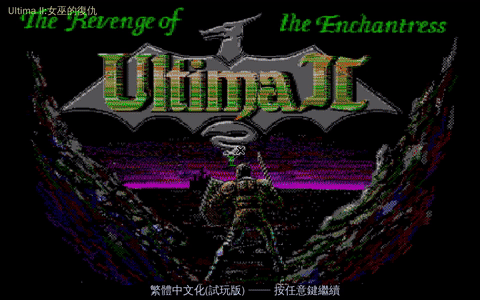
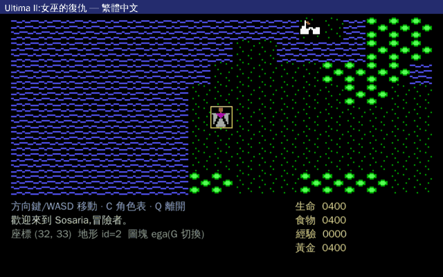

# 創世紀 II:女巫的復仇 — 繁體中文版
### Ultima II: The Revenge of the Enchantress — Traditional Chinese Remake

> 一款 **1982 年誕生、從未有過中文版** 的西方角色扮演經典,現在能用母語從頭玩到結局。
>
> 這個專案把它**重新接上電**:用乾淨重寫的跨平台 C / SDL2 引擎,讓它跑在現代
> **Windows / Linux / macOS** 上,完整繁體中文化——連 1990 年日版 **FM Towns** 的彩色美術、
> CD 配樂與原版音效,都從遊戲檔案裡挖了回來重新接上。


---

## ▶ 立即遊玩

跨三平台、**可從建角一路玩到擊敗女巫米娜克斯的結局**。

1. 到 **[Releases 下載頁](https://github.com/wicanr2/u2-cht/releases)** 取得你平台的版本
   （Windows `.zip` / Linux `.AppImage` / macOS `.app`）。
2. 把**你合法持有的** Ultima II 原版資料檔放進指定資料夾（見各包內說明）。
   *本專案只提供引擎,不散布原版遊戲資料——請自備合法副本。*
3. 開始遊玩。Windows 雙擊「玩遊戲.bat」、Linux 雙擊 AppImage、macOS 雙擊 `Ultima2.app`。

> 想自己編譯、或了解這背後的逆向工程是怎麼做的?見下方 [給開發者](#給開發者) 與
> **[工程技術文件 ENGINEERING.md](docs/ENGINEERING.md)**。

---

## 畫面


> 開場標題 → 建立角色（姓名 / 性別 / 種族 / 職業 / 屬性）→ 走進城鎮 → 與 NPC 交談 → 切換畫風。


> 在地面行走、踏入地牢切成第一人稱探索、任何時候按 `C` 叫出繁體中文角色資料表——同一套引擎無縫切換。


> 城鎮裡走到 NPC 旁按 `T` 交談,對話即時翻成繁體中文。


> 按 `G` 隨時切換美術風格:EGA → **FM Towns 日版彩色美術** → CGA …… 同一張地圖、同一引擎。


> 真實地牢資料驅動的第一人稱線框迷宮,含樓層 / 深度 HUD 與小地圖。

---

## 緣起

一九八二年,個人電腦還在用卡帶與磁片低語的年代,一位二十出頭的青年 **Richard Garriott**,
把自己化身成「不列顛王」,在螢幕那一格一格的圖塊裡,種下了西方角色扮演遊戲的種子。

那是一個你得自己畫地圖、自己記筆記的時代。沒有指引箭頭,沒有任務標記。
你是個從天而降的**異鄉人**,為了阻止女巫米娜克斯操弄時間的復仇,駕著小船、騎著馬、甚至搭上火箭,
穿過一道道時光之門,在史前、古代、核戰後的廢土與群星之間流浪——
只為在傳說時代的城堡盡頭,與她做個了斷。

四十多年過去,它從未有過中文版,連當年的引擎都被時代淘汰、再也跑不起來。
它像一封寄丟的舊信,靜靜躺在時間的某個角落。

如今我們把它重新接上電:讓那片像素海洋、那些樹下老人的低語,第一次用母語在你眼前展開。
這不只是重製一款遊戲,而是替一段差點被遺忘的記憶,點亮回家的燈。

---

## 關於這款遊戲

**《創世紀 II:女巫的復仇》** 由 **Richard Garriott**(遊戲中化身 **Lord British / 不列顛王**)設計,
1982 年發行,是奠定西方電腦角色扮演遊戲（CRPG）基礎的經典系列「創世紀」的第二作。

- **故事**:反派是女巫 **米娜克斯（Minax）**——前作大魔王蒙丹的徒弟。她操弄時間向世界復仇,
  你扮演的**異鄉人**必須穿越 **時間之門**,在史前、古代、現代、核戰後的「浩劫餘生」等不同時代,
  甚至搭火箭造訪太陽系各行星,最終於傳說時代的城堡擊敗她。
- **招牌玩法**:時空旅行 + 星際旅行 + 開放世界圖塊地圖 + NPC 對話 + 城鎮經濟。

本繁中重製忠實還原了上述主線,並以原版執行檔的演算法為依據對齊行為（細節見工程文件）。

---

## 你能玩到什麼

- **完整主線到結局**:建角 → 城鎮補給 / 取得載具 → 時空旅行各時代 → 取得**力場之戒**與**迅捷之劍 ENILNO**
  → 前往傳說時代擊敗米娜克斯 → 結局。陣亡會被不列顛王復活（失去半數黃金）。
- **五大時代穿越**:傳說時代 / 盤古大陸 / 西元前 1423 / 西元 1990 / 浩劫餘生,各時代的時間之門通往不同時代。
- **星際旅行**:火箭升空 → 深空 HYPERWARP 切換行星軌道 → 降落行星地表（含 X 行星）。
- **載具**:馬 / 船 / 飛機 / 火箭,各需對應道具才能駕馭。
- **城鎮與地牢**:商店買賣裝備與關鍵道具、與 NPC 交談、第一人稱地牢探索 + 法術 + 寶箱陷阱。
- **米娜克斯位移對決**:最終 BOSS 會在地圖兩角間瞬移、以力場火球轟炸,你得靠戒指免疫、用 ENILNO 追擊。
- **三種語言**:`F4` 即時切換 繁體中文 / English / 日本語。
- **多種美術風格**:`G` 切換 EGA / FM Towns 彩色 / CGA 等畫風。

### 操作

| 動作 | 按鍵 |
|---|---|
| 移動 / 攻擊 | 方向鍵 或 `W A S D`（朝怪物移動即攻擊） |
| 角色 / 任務資料表 | `C`（會依進度顯示下一步任務提示） |
| 與 NPC 交談 | `T` |
| 城鎮商店 | `Z` |
| 載具上 / 下 | `B`（馬 / 船 / 飛機 / 火箭） |
| 火箭發射 / 太空降落 | `Y` |
| 穿越時間之門 | `P` 或踏上青紫色時間之門 |
| 地牢上 / 下樓 | `K` / `J` |
| 切換美術風格 | `G` |
| 切換語言 | `F4` |
| 指令一覽 | `F1` |
| 取消 / 關閉視窗 | `ESC` |
| 離開遊戲（yes/no 確認,自動存檔） | `F10` |

---

## 音樂與音效

FM Towns（1990 日版）的音訊已從原版光碟挖出並接進遊戲:

- **CD 音樂(CDDA)**:開場與結局採用原版 FM Towns CD 配樂。
- **原版音效**:攻擊、魔法、開門、撞牆、穿越時間之門、怪物現身等,皆為 FM Towns 原版 PCM 音效。
- 遊玩中的 BGM（FM 合成的 EUP 序列）仍在處理中。

> 音訊資產同屬版權物,需自備;技術細節（CD 抽取、`.SND` 解碼、執行檔反組譯找音樂時機）見工程文件。

---

## 平台與需求

| 平台 | 形式 | 備註 |
|---|---|---|
| **Windows** | `.zip`(解壓即玩) | 內含執行檔 + SDL2 DLL |
| **Linux** | `.AppImage`(單檔) | Ubuntu 22.04+ |
| **macOS** | `.app`(GitHub Actions 原生編譯) | 首次開啟若被擋:右鍵 →「打開」 |

三平台都需**自備合法的 Ultima II 原版資料檔**。

---

## 專案狀態

**可端到端破關**——已有自動化回歸測試走完「建角 → 取得關鍵道具 → 時空旅行 → 擊敗米娜克斯 → 結局」全程。

| 已完成 | 處理中 |
|---|---|
| 主線玩法 + 結局、五大時代時空旅行、星際旅行 / X 行星 | 遊玩中 BGM（EUP→可播放音訊的算繪）|
| 載具系統、城鎮經濟、地牢探索 + 法術 + 寶箱陷阱 | 時間之門精確座標（目前為方位近似）|
| 任務鏈正典化、怪物專屬攻擊、米娜克斯位移對決 | 部分存檔欄位（待更多真實樣本）|
| FM Towns 彩色美術 / CD 音樂 / 原版音效 | |
| 完整繁中化(UI + NPC 對話)、三語切換 | |

> 這是一個忠實對齊原版、可破關的重製版——**並非位元級複製**。
> 已知差異(如遊玩 BGM、時間之門座標)如上表誠實標註。

---

## 給開發者

想自己編譯,或好奇「把一款 1982 年的遊戲反組譯、對齊、重寫、中文化」是怎麼辦到的?

- **快速編譯**(全程 Docker,需自備原版資料):
  ```bash
  git clone https://github.com/wicanr2/u2-cht.git && cd u2-cht
  # 三平台打包(Linux AppImage / Windows zip / macOS 原始碼包)
  docker run --rm -v "$PWD":/work -v <你的資料夾>:/data:ro -v /tmp/out:/out \
    u2cht-pkg bash -c 'cd /work && bash build_release.sh'
  ```
- **macOS 原生 .app**:由 GitHub Actions 在 macOS runner 上編譯,見 [`.github/workflows/build-mac.yml`](.github/workflows/build-mac.yml)。
- **完整工程技術文件**(反組譯策略、資料格式破解、FM Towns 考古、中文化管線、引擎架構、完整進度):
  ➡️ **[docs/ENGINEERING.md](docs/ENGINEERING.md)**

---

## 授權與免責

採「**引擎與資料分離**」:

- **本專案原創碼 / 工具 / 文件**:**MIT**。
- **原版遊戲資料 / 美術 / 音訊 / 反組譯來源 binary**:**不包含、不散布**,玩家須自備合法副本。

非商業之保存與在地化研究。著作權人如有異議請聯繫移除。詳見 [`LICENSE`](LICENSE)。

---

## 致謝

- **Richard Garriott (Lord British) / Sierra On-Line** — Ultima II 原作(1982)。
- **John Alderson** — Windows Native Ultima II 移植版,本案行為對照來源。
- **mcmagi / TheAlmightyGuru / shikadi ModdingWiki** — 資料格式逆向與保存。
- **Tomoaki Hayasaka（EUPPlayer / EUPHONY 作者）** — FM Towns 音樂格式與算繪工具。
- **姊妹專案** [u3-cht](https://github.com/wicanr2/u3-cht)（Ultima III）/ [u6-cht](https://github.com/wicanr2/u6-cht)（Ultima VI）。

譯名對照見 [`CONTEXT.md`](CONTEXT.md)。系列史實與逆向發現的詳細考證見 [工程技術文件](docs/ENGINEERING.md)。
