# Ultima II 怪物 / 角色圖鑑(FM Towns sprite)

> 圖來源:FM Towns《Ultima Trilogy》`GRAPH/UT1TILE0.TIF` 的 32×32 sprite(共 64 幀 = 32 個 ×2 幀動畫),
> 以**驗證過的 FM Towns palette**(`0黑 1綠 2紅 3洋紅 4藍 5青 6黃 7白`,見 [`FMTOWNS_TILESET.md`](FMTOWNS_TILESET.md) 附錄 C)解碼。
> 中英文名:**人型職業 / 女巫**取自 exe 內嵌字串(已確認);**其餘生物**為依外觀 + U2 已知 bestiary 的 best-effort 對應。
>
> ⚠️ **誠實標註**:FM Towns sprite 的「index → 哪隻怪物」官方順序尚未破解,
> 下表的 sprite↔名對應除「已確認」列外屬**視覺推測**,精確化需逆 ENCHANT.EXP 的 sprite 表。

## 已確認名(exe 內嵌字串)

| 英文 | 中文 |
|---|---|
| FIGHTER | 戰士 |
| CLERIC | 牧師 |
| WIZARD | 巫師 |
| THIEF | 盜賊 |
| DWARF | 矮人 |
| ENCHANTRESS (MINAX) | 女巫(米娜克斯) |

> 對應 U2 的四職業(玩家可選 / 城鎮 NPC / 敵人)+ 最終魔王。GREMLIN(小妖精)亦見於訊息字串。

## FM Towns sprite 圖鑑(32 個,2 幀動畫取第 1 幀)

| 圖 | 編號 | 英文(推測) | 中文(推測) | 信心 |
|---|---|---|---|---|
| 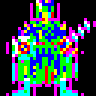 | m00 | Fighter / Guard | 戰士 / 守衛 | 推測(人型) |
| 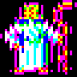 | m01 | Fighter | 戰士 | 推測(人型) |
| 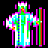 | m02 | Cleric / Townsfolk | 牧師 / 鎮民 | 推測(人型) |
| 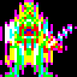 | m03 | Wizard | 巫師 | 推測(人型,持杖) |
| 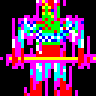 | m04 | Fighter | 戰士 | 推測(人型) |
| 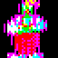 | m05 | Fighter | 戰士 | 推測(人型) |
| 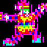 | m06 | Ranger / Archer | 遊俠 / 弓手 | 推測(動作姿態) |
| 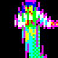 | m07 | Ranger / Archer | 遊俠 / 弓手 | 推測 |
| 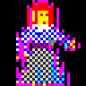 | m08 | Jester / Townsfolk | 弄臣 / 鎮民 | 推測(花格服) |
| 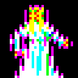 | m09 | Wizard / Cleric | 巫師 / 牧師 | 推測(白袍) |
| 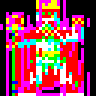 | m10 | Fighter | 戰士 | 推測(人型) |
| 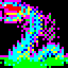 | m11 | Sea Serpent / Dragon | 海蛇 / 龍 | 較確定(蛇形) |
| 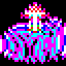 | m12 | Creature | 怪物(待辨識) | 推測 |
| 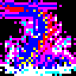 | m13 | Fighter | 戰士 | 推測(人型) |
| 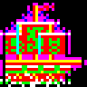 | m14 | Object / Cannon | 物件 / 砲座 | 推測(非人型) |
| 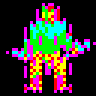 | m15 | Ogre / Troll | 食人魔 / 巨魔 | 較確定(綠巨人型) |
| 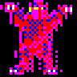 | m16 | Devil / Daemon | 惡魔 | 較確定(紅惡魔型) |
|  | m17 | Whirlpool / Effect | 漩渦 / 效果 | 推測(藍噪) |
|  | m18 | Fighter | 戰士 | 推測(持劍) |
| 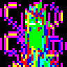 | m19 | Humanoid | 人型怪 | 推測 |
| 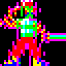 | m20 | Fighter | 戰士 | 推測(紅甲持劍) |
| 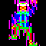 | m21 | Humanoid | 人型怪 | 推測 |
| 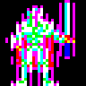 | m22 | Creature | 怪物(待辨識) | 推測 |
| 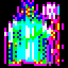 | m23 | Humanoid | 人型怪 | 推測 |
| 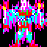 | m24 | Mage / Wizard | 法師 / 巫師 | 推測 |
| 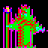 | m25 | Lich / Wizard | 巫妖 / 巫師 | 推測(高瘦) |
| 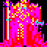 | m26 | Devil / Daemon | 惡魔 | 推測(紅) |
| 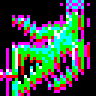 | m27 | Dragon / Serpent | 龍 / 蛇 | 較確定(蛇形) |
| 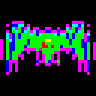 | m28 | Sea Serpent | 海蛇 | 較確定(海蛇) |
| 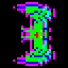 | m29 | Sea Serpent | 海蛇 | 較確定(海蛇) |
| 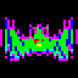 | m30 | Sea Serpent | 海蛇 | 較確定(海蛇) |
| 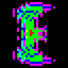 | m31 | Sea Serpent | 海蛇 | 較確定(海蛇) |

> 完整 sprite sheet(含第 2 幀動畫、上色):[`screenshots/fmtowns_monsters_colored.png`](screenshots/fmtowns_monsters_colored.png)。
> 抽取工具:[`tools/fmtowns_decode.py`](../tools/fmtowns_decode.py)。
</content>
