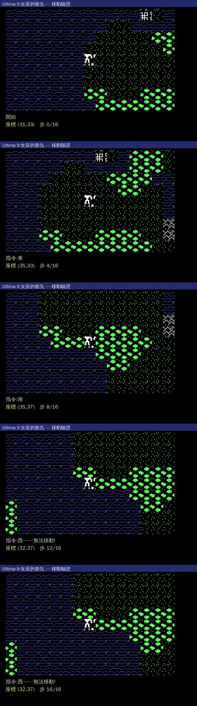

# 隊伍移動驗證(headless 截圖序列)

> 狀態:✅ 通過(2026-06-04)。task 1。以連續 PNG 幀驗證移動 / 鏡頭跟隨 / 碰撞,不需顯示器。

## 驗證內容

玩家恆置於畫面中央,地圖在腳下捲動(U2 慣例)。在地球 overworld(`mapx20`)起點 (31,33),
跑序列 `EEEESSSSWWWWWWWW`(東4 南4 西8),逐步輸出一幀:



| 幀 | 座標 | 訊息 | 結果 |
|---|---|---|---|
| 0 | (31,33) | 開始 | 玩家置中、海岸 |
| 4 | (35,33) | 指令:東 | x 31→35,鏡頭跟隨捲動 ✅ |
| 8 | (35,37) | 指令:南 | y 33→37,捲動 ✅ |
| 12 | (32,37) | 指令:西──無法移動! | 西行 35→32 後撞海被擋 ✅ |
| 16 | (32,37) | 西──無法移動! | 持續被海洋擋住 ✅ |

三項皆正確:**移動座標更新 / 鏡頭跟隨地圖捲動 / 海洋碰撞阻擋**。

## 架構

```
src/
  u2_play.{h,c}   # 玩家狀態 + 移動 + 可通行判定 (passable)
  demo_main.c     # 移動序列 → 每步一幀 PNG (u2_demo)
```

## 重現

```bash
./build_demo.sh ../dos-original/ultima2/mapx20 EEEESSSSWWWWWWWW build/move blue 31 33
# → build/move_00.png .. move_16.png
```

## 已知簡化(後續)

- **可通行表只擋海洋(id 0)** → 待對照 oracle 補山脈/牆等(`u2_passable`)。
- **無真互動**(序列由參數給)→ 後續可開 SDL 視窗接鍵盤(需顯示器)。
- **player 存檔(384B)未解析** → 起點目前由參數給;後續解析真實隊伍位置/屬性。
- 載具(船/馬/飛機/火箭)、地牢 3D、戰鬥尚未接。
