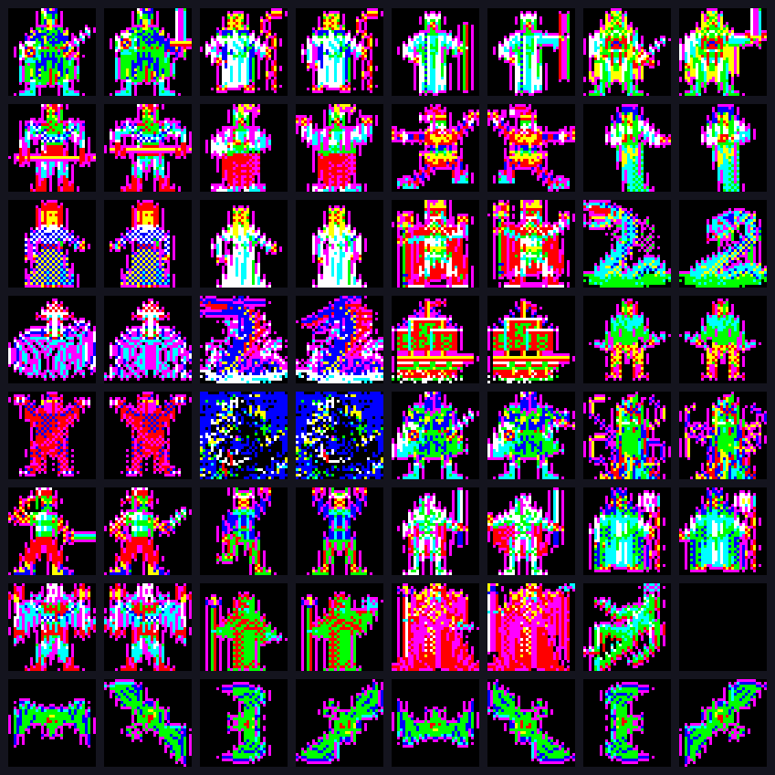
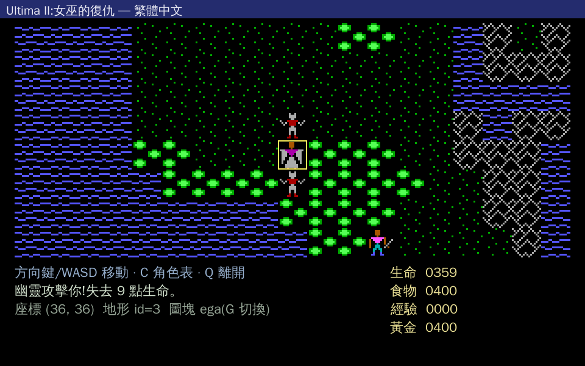

# 第一章 · 怪物圖鑑

> 回 [攻略總目錄](../GUIDE.md)

本章整合三個來源:
- **HP / 攻擊力**:以本 repo 重製引擎 `src/game_main.c` 的 `mob_type()`(已對齊正典 bestiary)為主;
- **特殊能力 / 掉落 / 出沒**:Codex of Ultima Wisdom — [Ultima II monster data](https://wiki.ultimacodex.com/wiki/Ultima_II_monster_data);
- **sprite 圖**:FM Towns 版(模擬器抽出彩色 sprite,見 [`MONSTERS.md`](../MONSTERS.md))與引擎內 EGA tile。

> ⚠️ **誠實標註**:DOS/EGA 版怪物在主地圖以單格 tile 呈現(綠/紅小妖),**沒有逐隻精緻 sprite**;真正有「畫得出來的怪物像」的是 FM Towns 版。FM Towns sprite「index → 哪隻怪」官方順序尚未完全破解,下表標「視覺較確定 / 推測」。EGA 版 sprite 對照標「待補」者,可從本 repo `tools/decode_u2upgrade_tiles.py` 抽 U2 Upgrade EGA tileset 補齊。

---

## 1.1 主世界 / 陸海怪物(數值真值表)

下表 HP/攻擊力來自引擎 `mob_type()`,直接對齊 Codex bestiary。引擎主世界與地牢共用這 8 種戰鬥怪(tile id 12–15、60–63):

| 中文 | 英文 | 引擎 tile | HP | 攻擊力 | 特殊能力 | 出沒 |
|---|---|---|---|---|---|---|
| 蜥蜴人 / 半獸人 | Orc | 12 | 16 | 4 | — | 陸地 / 地牢 |
| 幽靈 | Ghost | 13 | 49 | 6 | 吹熄火把(地牢) | 地牢 |
| 魔鬼 | Devil | 14 | 192 | 8 | **麻痺雙臂**(範圍 2) | 陸地 / 深層地牢 |
| 炎魔(巴爾龍) | Balron | 15 | 255 | 10 | **催眠 / 睡眠**(範圍 2) | 陸地 / 深層地牢 |
| 哥布林 | Goblin | 60 | 5 | 3 | **偷食物** | 陸地 / 地牢 |
| 盜賊 | Thief | 61 | 32 | 5 | **偷道具 / 偷金** | 陸地 / 城鎮 |
| 惡魔 | Daemon | 62 | 64 | 7 | **麻痺雙腿**(範圍 2) | 陸地 / 深層地牢 |
| 海蛇 | Sea Serpent | 63 | 64 | 6 | — | 海上 |

> **引擎特殊攻擊對齊**(`src/game_main.c` 註解,[正典] U2 monster data):
> Daemon=麻腿 · Devil=麻臂 · Balron=睡眠 · Goblin=偷食 · Thief=偷金/偷物。其餘(蜥蜴人/幽靈/海蛇)純物理攻擊。
> 防護道具:**魔法靴 BOOTS** 防腿麻、**魔法袍 CLOAK** 防臂麻、**綠色神像 GREEN IDOL** 防睡眠。

### Codex 完整 bestiary(含本引擎未獨立建模的高階怪)

下表為原版完整怪物表(Codex)。引擎把戰鬥簡化為上面 8 種核心怪;以下高 HP 怪(戰士/海盜船/巫師)在正典屬主世界強敵,HP 取原版值:

| # | 英文 | 中文 | HP | 特殊能力 | 掉落 | 類別 |
|---|---|---|---|---|---|---|
| 1 | Orc | 半獸人 | 16 | — | — | 陸地 |
| 2 | Goblin | 哥布林 | 5 | — | — | 陸地 |
| 3 | Thief | 盜賊 | 32 | 偷道具 | 任意物品 | 陸地 |
| 4 | Daemon | 惡魔 | 64 | 麻腿(範圍 2) | — | 陸地 |
| 5 | Sea Serpent | 海蛇 | 64 | — | — | 海上 |
| 6 | Fighter | 戰士 | 128 | — | 火把、頭盔 | 陸地 |
| 7 | Pirate Ship | 海盜船 | 160 | — | — | 海上 |
| 8 | Devil | 魔鬼 | 192 | 麻臂(範圍 2) | — | 陸地 |
| 9 | Wizard | 巫師 | 224 | 魔法飛彈(範圍 2) | 法杖、魔杖 | 陸地 |
| 10 | Balron | 炎魔 | 255 | 催眠(範圍 2) | — | 陸地 |

> ⚠️ 引擎與正典差異:本重製把主世界戰鬥怪收斂成 8 種(蜥蜴人=Orc 視覺、無獨立 Fighter/Pirate Ship/Wizard 實體)。要 100% 正典需擴充 `mob_type()`;目前 HP 上限的「炎魔 255」已正確對齊最強雜兵。

---

## 1.2 城鎮居民

城鎮裡的 NPC 有些可交談給線索,有些(守衛)會跟你開打:

| 英文 | 中文 | HP | 說明 | 掉落 |
|---|---|---|---|---|
| Jester | 弄臣 | 1–255 | 講笑話/謎語的 NPC | — |
| Merchant | 商人 | 5–50 | 商店老闆 | 紅寶石 RED GEM |
| Cleric | 牧師 | 10–60 | 給線索的 NPC | — |
| Thief | 盜賊 | 32 | 城內也會偷你東西 | 任意物品 |
| Wizard | 巫師 | 224 | 城內強敵 | 法杖、魔杖 |
| **Guard** | **守衛** | **255** | 索稅/維安,惹毛會圍毆你 | **2 把鑰匙** |

> **守衛機制(引擎已實作,對齊 oracle)**:守衛 = tile 24、status 255。交談會索取 30 金(`PAY YOUR TAXES`);繳不出或攻擊守衛 → **全城守衛敵對**,每回合朝你貪婪移動圍毆。擊倒守衛 → 取得**鑰匙(GUARDS CARRY KEYS)**,可用於 UNLOCK 上鎖門。
> **YELL / STEAL**:`YELL` 會引出市民正典台詞;`STEAL` 向商店行竊(敏捷決定得手率,失敗引守衛揍你)。

---

## 1.3 地牢怪物（依層深增強）

地牢怪 HP 隨層數成長(原版 Codex 給的是 HP 區間)。引擎用 `dg_pick_mob_tile()`:**淺層(1–5)**出蜥蜴人/哥布林/盜賊/幽靈,**深層(6+)** 出魔鬼/炎魔/惡魔/海蛇/幽靈,愈深愈多愈強(每 3 層多 1 隻,上限 6 隻/層)。

| 怪物 | 中文 | HP 區間(Codex) | 出沒層級 | 特殊能力 |
|---|---|---|---|---|
| Orc | 半獸人 | 17–153 | 1–16 | — |
| Ghost | 幽靈 | 49–153 | 3–16 | **吹滅火把** |
| Carrion Creeper | 食屍爬蟲 | 81–185 | 5–16 | — |
| Viper | 毒蛇 | 113–185 | 7–16 | — |
| Gremlin | 小妖精 | 145–217 | 9–16 | **偷食物** |
| Daemon | 惡魔 | 177–217 | 11–16 | — |
| Balron | 炎魔 | 209–249 | 13–16 | **催眠** |

> 地牢戰鬥公式(引擎對齊 oracle):DIRECT 攻擊**必中**,傷害 = `rng & 0x3f | 0x20`(32–95),擊殺給經驗 `rng&7 + 1`、金幣 `rng%0x11 + 1`(1–17)。

---

## 1.4 魔王 · 米娜克斯（Minax）

| 名稱 | HP | 攻擊力 | 特殊能力 |
|---|---|---|---|
| **米娜克斯(女巫)Minax** | — | **每次固定 100 點傷害** | 瞬移、遠距攻擊(範圍 3) |

- type `0x10`,在傳說時代座標 9-9-9(暗影衛城東北角)現身。
- 接近時喊 `MINAX CRIES: DIE FOOL`,對你造**固定 100 傷**(範圍 3,不靠近也打得到)。
- **力場(FIELD)**:她周圍力場造成 1000 傷,**必須持有力場之戒(RING)** 才能穿過(`RING PROTECTS FROM FIELD`)。
- 被攻擊未死會**瞬移**到西南角(`SHE'S GONE`),需追過去。
- **一擊必殺**:用**迅捷之劍 ENILNO** 攻擊到她即觸發勝利結局(`FUN_0040eb60`)。
- 詳細打法見 [第四章 · 最終決戰](04-walkthrough.md#第五步傳說時代決戰米娜克斯)。

---

## 1.5 FM Towns sprite 圖鑑（彩色精緻版）

FM Towns 版(1990 Fujitsu)把怪物全部重畫成彩色 sprite。以下取 `GRAPH/UT1TILE0.TIF` 抽出的 32 個 sprite(每個第 1 幀),以驗證過的 FM Towns palette 上色。**index ↔ 怪物名的官方對應未完全破解**,信心如表所示。

| sprite | 推測對應 | 中文 | 信心 |
|---|---|---|---|
|  | Fighter / Guard | 戰士 / 守衛 | 推測(人型甲) |
|  | Wizard | 巫師 | 推測(持杖) |
|  | Jester | 弄臣 | 較確定(花格服) |
|  | Sea Serpent | 海蛇 | 較確定(蛇形) |
|  | Carrion Creeper | 食屍爬蟲 | 推測(蟲形) |
|  | Daemon / Devil | 惡魔 / 魔鬼 | 較確定(綠巨型) |
|  | Devil / Balron | 魔鬼 / 炎魔 | 較確定(紅惡魔) |
|  | Gremlin | 小妖精 | 推測 |
|  | Sea Serpent / Daemon | 海蛇 / 惡魔 | 較確定(蛇形) |

> 完整 32 個 sprite 對照表見 [`MONSTERS.md`](../MONSTERS.md);
> 全圖(含動畫第 2 幀):[`screenshots/fmtowns_monsters_colored.png`](../screenshots/fmtowns_monsters_colored.png)。

### 版本對照狀態

| 版本 | sprite 狀態 |
|---|---|
| **FM Towns(1990)** | ✅ 已抽出 32 個彩色 sprite(`docs/monsters/m00–m31.png`),index↔名部分推測 |
| **DOS / EGA(1982 原版)** | 🟡 主世界怪物為單格 EGA tile(綠/紅小妖、蛇形),非精緻 sprite。**待補**:可從 U2 Upgrade `EGATILES` 以 `tools/decode_u2upgrade_tiles.py sheet` 抽 65-tile 對照圖,id 12–15/60–63 即怪物 tile(見 [`DATA_FORMATS.md`](../DATA_FORMATS.md))。原版本就沒有「一隻怪一張立繪」,只有 16×16 地圖 tile。 |

引擎內怪物實際渲染(EGA tile + FM Towns 疊圖切換)可見戰鬥畫面:

---

## 來源

- 怪物數值真值:`src/game_main.c` `mob_type()`(引擎,對齊正典)
- 特殊能力 / 掉落 / 區間:[Codex of Ultima Wisdom — Ultima II monster data](https://wiki.ultimacodex.com/wiki/Ultima_II_monster_data)
- 戰鬥 / 狀態機制:[`docs/ORACLE_MECHANICS.md`](../ORACLE_MECHANICS.md)(反組譯 oracle)
- FM Towns sprite:[`docs/MONSTERS.md`](../MONSTERS.md) · [`docs/FMTOWNS_TILESET.md`](../FMTOWNS_TILESET.md)
</content>
