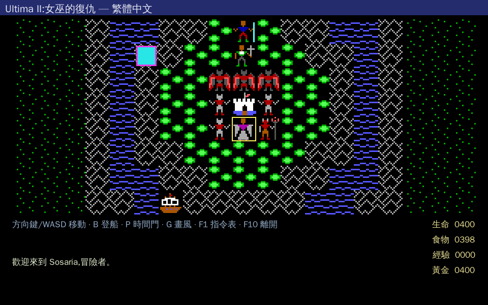
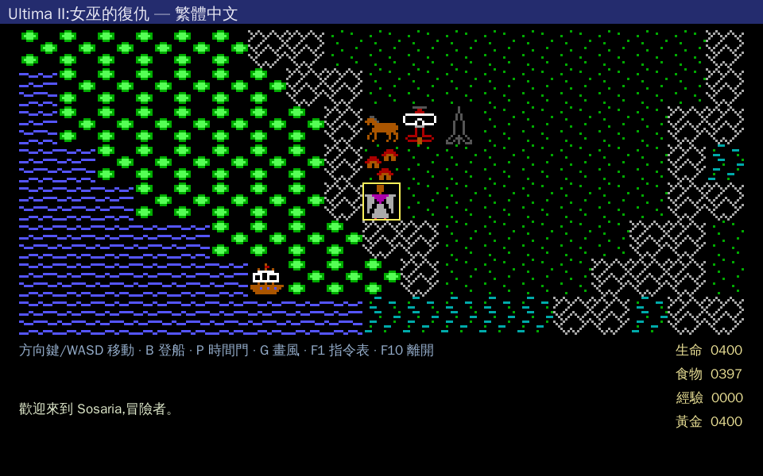
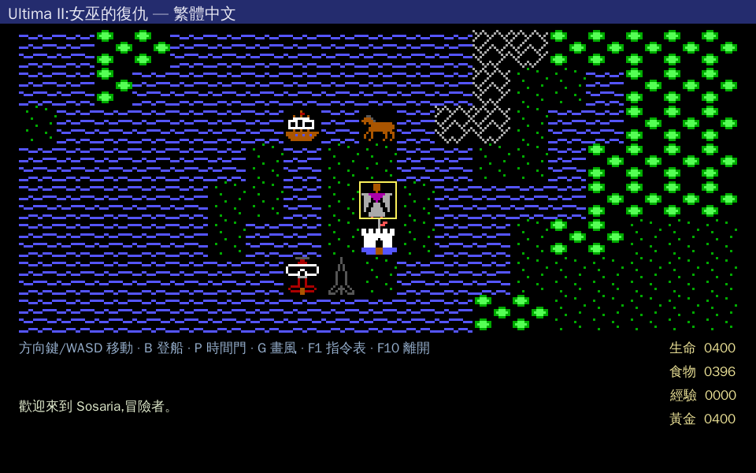
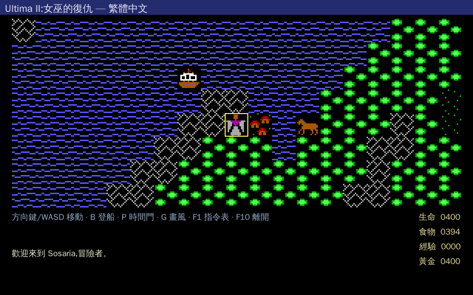

# 第二章 · 世界地圖

> 回 [攻略總目錄](../GUIDE.md)

Ultima II 的世界由兩層構成:**地球的五大時代**(各一張 64×64 大地圖)與**太陽系九大行星**。地圖會環形相接(toroidal wrap)——往一邊走到底會接回另一邊。

> 截圖說明:以下五張 overworld 為本 repo SDL2 重製引擎(docker headless)產生,繁中 UI。畫面中可見海(藍波浪)、草地、森林(綠叢)、山脈(灰白菱形)、城堡/城鎮等 landmark,以及主角腳下的載具(船/馬/飛機/火箭)。地標座標取自 [`MAP_REGISTRY.md`](../MAP_REGISTRY.md)(資料驅動掃描 mapxNN)。

---

## 2.1 五大時代 overworld

### 時代 0 — 傳說時代(Time of Legends)`mapx00`

- **米娜克斯的巢穴所在**,終戰場。地圖上 landmark tile 8(城堡)= 暗影衛城(Castle Shadowguard)。
- 正典:**四道時間之門相鄰並排**(這是無時間的時代,所有門聚在一起,見第四章)。
- landmark(掃描):城堡 8@32,32、時間之門 10@32,54。
- 一般流程**最後**才來這裡,且要先備齊力場之戒 + 迅捷之劍。

### 時代 1 — 盤古大陸(9,000,000 B.C. / Pangea)`mapx10`

- 上古超大陸,陸塊完整(水域少)。城鎮 Baradins Town。
- landmark:村莊 5@20,55、時間之門 10@33,58。
- 時間之門方位:北→傳說、東(歐亞)→1423BC、中(原非洲)→2112、南(原南極)→1990。

### 時代 2 — 西元前 1423 年 `mapx20`（遊戲起點）

- **新角色從這裡開始**(北美大湖區附近)。可見 Lord British 城堡、城鎮 Towne Linda。
- landmark 最豐富:村莊 5@38,46、城鎮 6@36,29、塔 7@24,40、城堡 8@35,22、地牢 9@25,5、時間之門 10@58,51。
- 時間之門方位:北美→傳說、南美→2112、西歐→1990、東歐→盤古。
- 開局策略:向西北跨白令海峽陸橋到歐洲,在 Towne Linda 買斧頭與鎖子甲,再到非洲村莊囤食物。

### 時代 3 — 西元 1990 年 `mapx30`

- **最重要的補給/升級時代**。城鎮 New San Antonio(內有 Hotel California 升屬性點)、Port Bonifice。
- landmark:村莊 5@34,20、城鎮 6@15,26、塔 7@38,31、城堡 8@35,22、地牢 9@25,5、時間之門 10@58,51。
- 這裡可拿到飛機(骷髏鑰/黃銅鈕扣)、迅捷之劍 ENILNO(Sentri 被囚於 New San Antonio)、力場之戒(向老人付金)。

### 時代 4 — 浩劫餘生(2112 A.D. / Aftermath)`mapx40`

- 末日後地球,城鎮 Pirates Harbor(海盜港)。
- landmark:村莊 5@44,14、地牢 9@25,5、時間之門 10@58,51。
- **火箭發射點**在這裡(Pirate Harbor 的紅色方格);上太空找 Ankh / 三鋰前必經。

---

## 2.2 各時代地標 / 時間之門總表

整合 RPGClassics + StrategyWiki,各時代的主要城鎮與四道時間之門目的地:

| 時代 | 主要城鎮 / 城堡 | 四道時間之門(方位 → 目的地) |
|---|---|---|
| **傳說(Legends)** | Castle Shadowguard(米娜克斯巢穴) | 四門相鄰:① 盤古 · ② 1423BC/歐 · ③ 1990/英 · ④ 2112/北美 |
| **盤古(Pangea)** | Baradins Town | 北→傳說 · 東(歐亞)→1423BC/俄 · 中→2112/北美 · 南→1990/英 |
| **1423 B.C.** | Lord British 城堡、Towne Linda | 北美→傳說 · 南美→2112/北美 · 西歐→1990/英 · 東歐(亞)→盤古 |
| **1990 A.D.** | New San Antonio、Port Bonifice | 格陵蘭→盤古 · 南美→2112/北美 · 英→1423BC/歐 · 澳洲→傳說 |
| **2112 A.D.** | Pirates Harbor | 西北美→1990/南美 · 東南美→傳說 · 中亞→1423BC/歐 · 南亞→盤古 |

> 引擎 `ERA_GATES[5][4]` 即依此拓樸實作(座標為 64×64 象限近似,見 [`ORACLE_MECHANICS.md`](../ORACLE_MECHANICS.md))。各門通往哪、何時開,詳見 [第四章 · 時間之門完整解說](04-walkthrough.md#時間之門time-door完整解說)。

---

## 2.3 太陽系九大行星

火箭發射上太空後,用 **HYPERWARP** 輸入三元座標(XENO,YAKO,ZABO,各 0–9)躍遷到目標行星軌道,再按 LAND 降落。座標來自 oracle `FUN_0040e210`(行星查表):

| 行星 | 座標 (XENO,YAKO,ZABO) | 備註 |
|---|---|---|
| 地球 EARTH | **6,6,6** | 火箭發射後初始軌道即此 |
| 水星 MERCURY | 5,4,5 | |
| 金星 VENUS | 3,3,4 | |
| 火星 MARS | 6,2,3 | |
| 木星 JUPITER | 1,3,4 | |
| 土星 SATURN | 2,8,5 | |
| 天王星 URANUS | 9,4,6 | |
| 海王星 NEPTUNE | 4,0,5 | |
| 冥王星 PLUTO | 0,1,4 | |
| (Planet X / 特殊) | **9,9,9** | Father Antos 賜戒指任務 → Castle Barataria |
| ☀️ 太陽 | 4,4,4 | `HIT THE SUN` **即死** |
| 其他座標 | — | 落入「深空 DEEP SPACE」,需重新躍遷 |

> ⚠️ **正典 bug 提醒**(StrategyWiki / RPGClassics):PC CD-ROM 版有 bug,部分行星實際上**到不了**。主線只需到 **Planet X(9,9,9)** 找 Father Antos,其餘行星多為支線/探索。

---

## 來源

- 各時代 overworld 截圖:本 repo SDL2 重製引擎(`build_game.sh` / docker headless,2026-06-13)
- landmark 座標:[`docs/MAP_REGISTRY.md`](../MAP_REGISTRY.md)(掃描 mapx00–93)
- 城鎮名 / 時間之門目的地:[RPGClassics U2 Overworld](https://shrines.rpgclassics.com/pc/ultima2/overworld.shtml) · [StrategyWiki Time Gates](https://strategywiki.org/wiki/Ultima_II:_The_Revenge_of_the_Enchantress/Time_Gates)
- 行星座標:[`docs/ORACLE_MECHANICS.md`](../ORACLE_MECHANICS.md) `FUN_0040e210`(反組譯 oracle,[確定])
</content>
